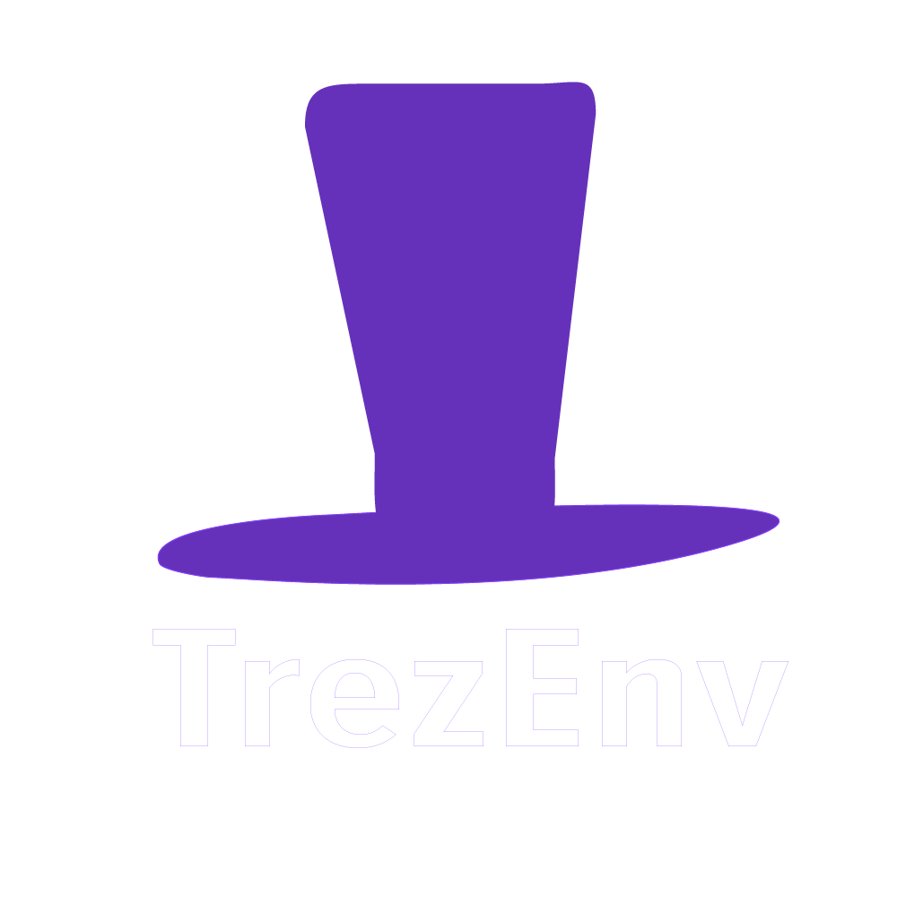

<br />
<div align="center">
  <a href="https://github.com/othneildrew/Best-README-Template">
    
  </a>

<h2 align="center">Trezenv </h2>

<p align="center">
    A CLI tool to produce a project local vcpkg installation. Create replicable C++ environments with ease and manage dependencies using the vcpkg toolchain. 
    <br />
    <!-- <a href="https://github.com/othneildrew/Best-README-Template"><strong>Explore the docs »</strong></a>
    <br />
    <br />
    <a href="https://github.com/othneildrew/Best-README-Template">View Demo</a>
    ·
    <a href="https://github.com/othneildrew/Best-README-Template/issues/new?labels=bug&template=bug-report---.md">Report Bug</a>
    ·
    <a href="https://github.com/othneildrew/Best-README-Template/issues/new?labels=enhancement&template=feature-request---.md">Request Feature</a> -->
  </p>
</div>

<!-- TABLE OF CONTENTS -->

<p>
  <summary>Table of Contents</summary>
  <ol>
    <li>
      <a href="#readme-top">About The Project</a>
      <ul>
        <li><a href="#contributors">Built With</a></li>
      </ul>
    </li>
    <li>
      <a href="#Installation">Getting Started</a>
      <ul>
        <li><a href="#compiling-from-source">Installation</a></li>
      </ul>
    </li>
    <li><a href="#usage">Usage</a></li>
    <li><a href="#roadmap">Roadmap</a></li>
    <li><a href="#Contributing-and-guidelines">Contributing</a></li>
    <li><a href="#license">License</a></li>
    <li><a href="#donations">Contact</a></li>
    <li><a href="#acknowledgments">Acknowledgments</a></li>
  </ol>
</p>

## Contributors

<a href="https://github.com/Sekuora/Trezenv/graphs/contributors">
  
</a>

We are grateful for all these contributors!


## Installation

Requirements for the software and other tools to build, test and push 
- [Python >= 3.12](https://www.python.org/downloads/)
- requirements.txt


### Compiling from source

Clone this repository:

  ```sh
  git clone https://github.com/github_username/repo_name.git
  ```

Open the project with your IDE of preference and run:

  ```sh
  pip install -r requirements.txt
  ```

Build executable -> in project root run this.
  ```sh
  nuitka --standalone --onefile trezenv.py
  ```

Now, you should have a binary file ready to use, or download the precompiled version from releases.


## Usage

Use this space to show useful examples of how a project can be used. Additional screenshots, code examples and demos work well in this space. You may also link to more resources.


<!-- ROADMAP -->

## Roadmap

- [X] Install dependencies from trezenv file
- [X] Get project dependencies ready with a sinigle trezenv init command
- [X] Work with vcpkg manifest mode
- [ ] Improve trezenv file parsing add support for triplets
- [ ] Create fully featured docs and video demo
- [ ] Add more easy to use commands for miscellaneous features
- [ ] Add and test support with various build tools


See the [open issues](https://github.com/Sekuora/Trezenv/issues) for a full list of proposed features (and known issues).

<!-- CONTRIBUTING -->

## Contributing and guidelines

Contributions are what make the open source community such an amazing place to learn, inspire, and create. Any contributions you make are **greatly appreciated**.

If you have a suggestion that would make the project better, please fork the repo and create a pull request.
Don't forget to give the project a star! Thanks again!

1. Fork the Project
2. Create your Feature Branch (`git checkout -b feature/AmazingFeature`)
3. Commit your Changes (`git commit -m 'Add some AmazingFeature'`)
4. Push to the Branch (`git push origin feature/AmazingFeature`)
5. Open a Pull Request


<!-- License -->

## License

 Licensed under <a href="https://www.tldrlegal.com/license/apache-license-2-0-apache-2-0" >  Apache-2.0 License
    
  </a>

## Donations

In hopes you have found the project useful and want to support development I share the platforms where you can show your support! 💓 Any donations are greatly appreciated!

## Acknolwdgements
Thanks to https://github.com/othneildrew/Best-README-Template for the readme template

